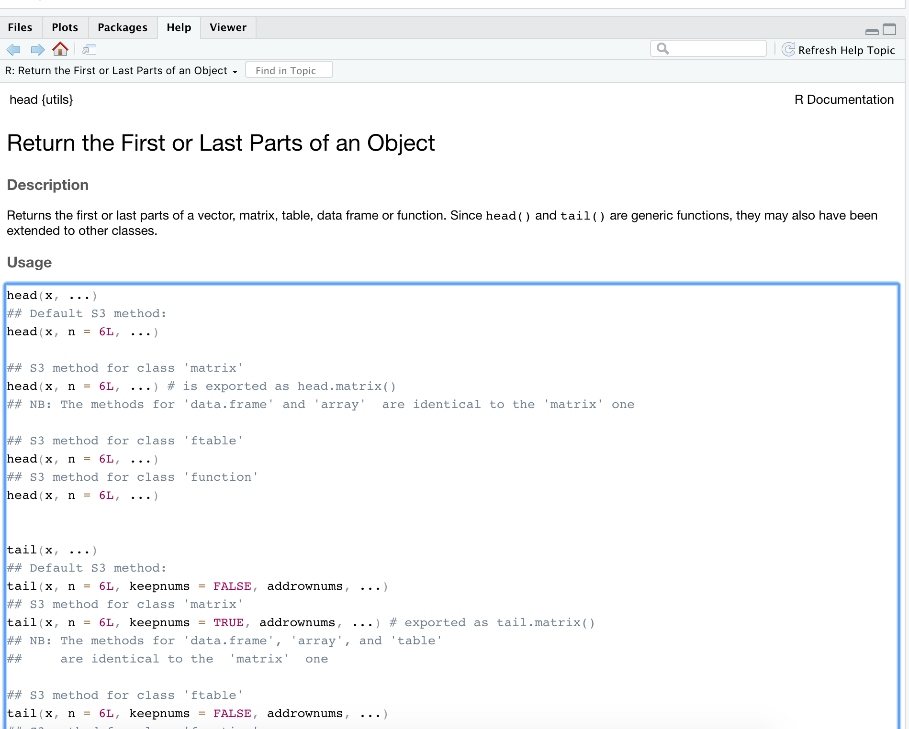

```{r setup, include=FALSE}
options(htmltools.dir.version = FALSE)
knitr::opts_chunk$set(
  fig.width=9, fig.height=3.5, fig.retina=3,
  out.width = "100%",
  cache = FALSE,
  echo = TRUE,
  message = FALSE, 
  warning = FALSE,
  fig.show = TRUE,
  hiline = TRUE,
  comment = NA
)
```

<style type="text/css">
.remark-slide-content {
    font-size: 35px;
}
</style>


<style type="text/css">
.remark-slide-content {
    font-size: 35px;
}
</style>

<style>
p.comment {
background-color: #DBDBDB;
padding: 10px;
border: 1px solid black;
margin-left: 25px;
border-radius: 5px;
font-style: italic;
}

</style>


```{css, echo = FALSE}
h1, #TOC>ul>li {
  color: #1b9e77;
  font-weight: bold;
}
h2, #TOC>ul>ul>li {
  color:  #1b9e77;
  #font-family:  "Times";
  font-weight: bold;
}
h3, #TOC>ul>ul>li {
  color: #00441b;
  #font-family:  "Times";
  font-weight: bold;
}
```

```{r xaringan-themer, include=FALSE, warning=FALSE}
library(xaringanthemer)
style_duo_accent(
  primary_color = "#081d58",
  title_slide_text_color = "#edf8b1",
  secondary_color = "#FF961C",
  inverse_header_color = "#081d58",
  text_font_size = "1em",
  text_color = "#000",
  text_bold_color = "#fd8d3c",

  
)
#style_solarized_light(text_font_google   = google_font("Josefin Sans", "400", "400i", "800i", "800"),
# text_color = "#000",
#  text_font_size = "1em")
#style_mono_light(
#  base_color = "#1c5253",
#  header_font_google = google_font("Josefin Sans"),
#  text_font_google   = google_font("Josefin Sans", "400", "400i", "800i", "800"),
#  code_font_google   = google_font("Fira Mono")
#)
```


.pull-left[

## Data structures

Way to **store and organize data** so that it can be used efficiently.

```{r, comment=NA}
marks <- c(100, 40, 34, 97, 98)
marks
```


]

--
.pull-right[

## Functions 

Tell R to **do something**

```{r, comment=NA}
mean(marks)
summary(marks)
```


]


---

## Data structures

```{r, comment=NA, echo=FALSE, out.width="80%"}
knitr::include_graphics("ds.png")

```

Source: Ceballos and Cardiel, 2013


---

Longer version is available at: 
https://r4fun.netlify.app/blog/topic5/

---
## Required R package

```{r, comment=NA, message=TRUE, warning=TRUE}
library(tidyverse)
```

---
## iris dataset


---


---

```{r}
iris
```

---

```{r}
summary(iris)
```

---

# Some useful functions

.pull-left[

```{r}
mean(iris$Sepal.Length) 
median(iris$Sepal.Width)
sd(iris$Sepal.Length) 
```


]

.pull-right[

```{r}
sum(iris$Sepal.Length)
length(iris$Sepal.Length)
```


]

---

# Inputs to a function

.pull-left[

```{r}
head(iris)

head(iris, 3)
```

]

.pull-right[


]

---

# Data visualisation

```{r, comment=NA, message=FALSE}
library(tidyverse)
```

```{r, fig.height=3}
ggplot(iris, aes(x=Sepal.Length, y=Sepal.Width, col=Species)) + geom_point() 
```

---

# Help file

.pull-left[

```r
?mean
help(mean)
```

]

.pull-right[

```{r, comment=NA, out.width="170%", echo=FALSE}
knitr::include_graphics("help.png")
```
]
---

# Commenting

```{r}
mean(iris$Sepal.Length, na.rm=TRUE) # compute mean of SL
```


---
## Pipe operator (`|>`)


.pull-left[

```{r}
mean(iris$Sepal.Length) 
mean(iris$Sepal.Length, na.rm=TRUE)
```

]

.pull-right[
```{r}
library(magrittr)
iris$Sepal.Length |> mean() 
iris$Sepal.Length |> mean(na.rm=TRUE)
```

]
---

## Another Version Pipe operator (`%>%`)

.pull-left[

```{r}
mean(iris$Sepal.Length) 
mean(iris$Sepal.Length, na.rm=TRUE)
```

]

.pull-right[
```{r}
library(magrittr)
iris$Sepal.Length %>% mean() 
iris$Sepal.Length %>% mean(na.rm=TRUE)
```


]


---

## Pipe operator (`%>%`)


---
## Built-in dataset

```{r}
library(palmerpenguins)
data(penguins)
head(penguins)
```


---

## Skim data

```{r, eval=FALSE}
library(skimr)
skim(penguins)
```

---


# Recap

 ✅ Data structures and functions
 
 ✅ Working with packages
 
 ✅  Functions in R
 
 ✅ Help file
 
 ✅ Commenting
 

 
 
 
 